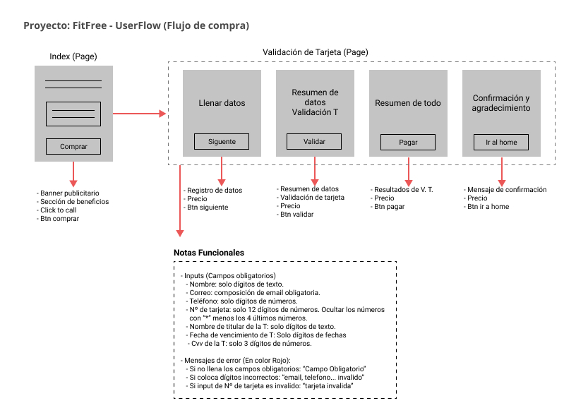
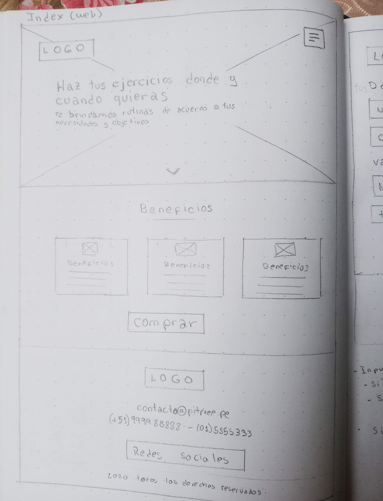
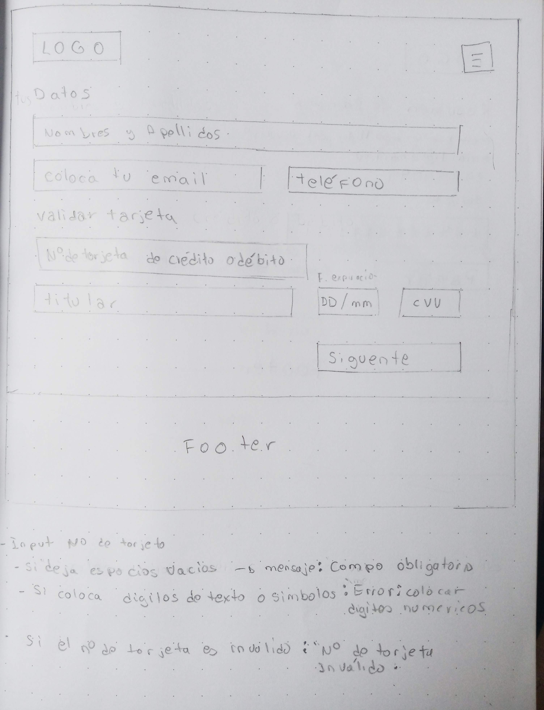
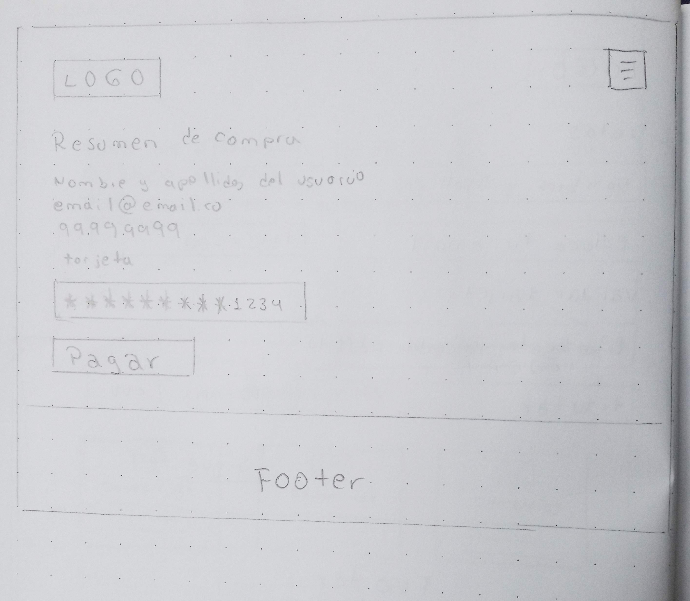
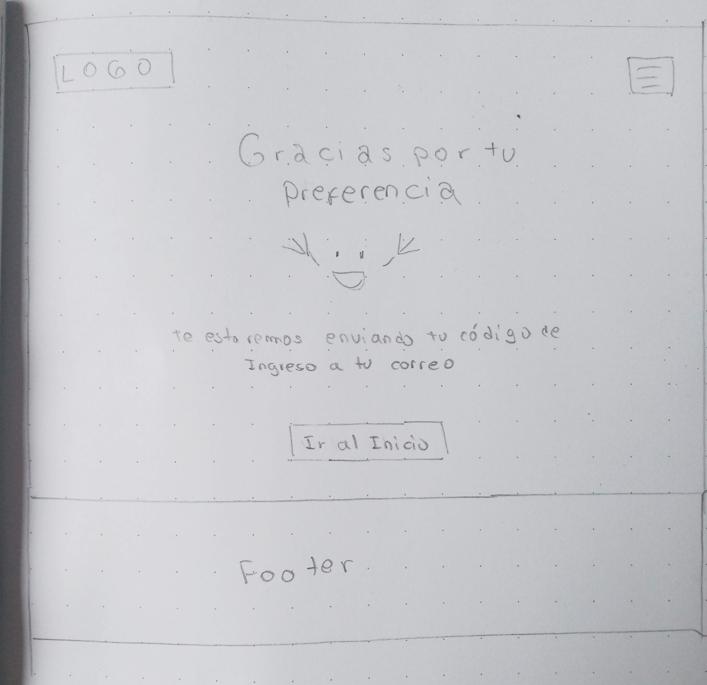
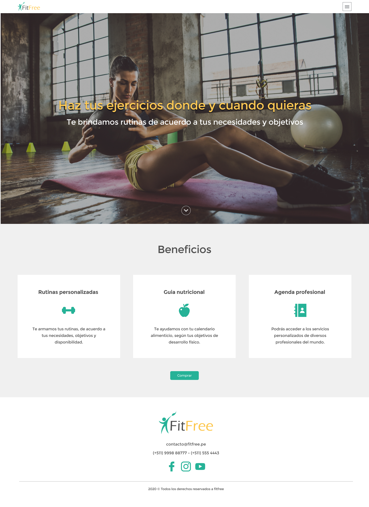
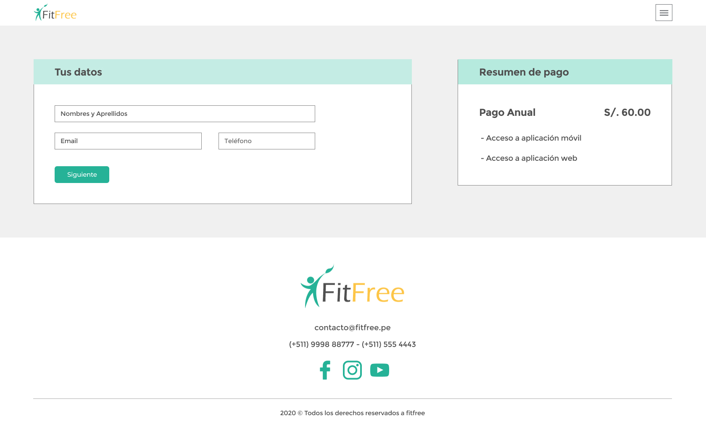
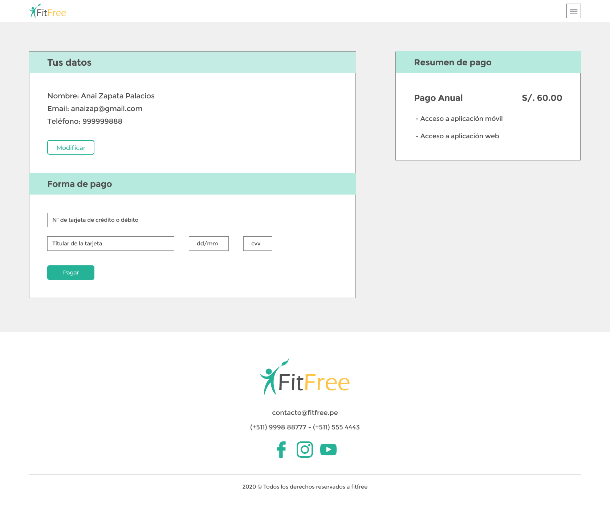
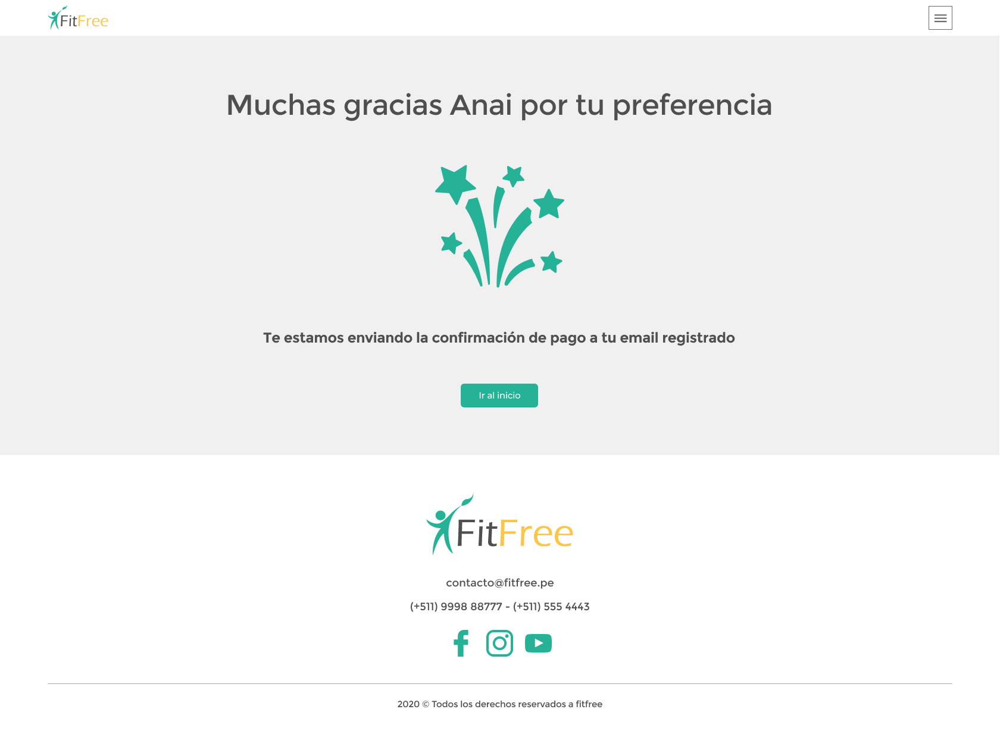

# Proyecto Card Validation

## 1. Nombre de la marca: Fitfree

## 2. Instalación: 

La aplicación se puede acceder a través de la página web o descargándolo del App Store. Entrando en la aplicación web se podrá realizar el pago a través de una pasarela de pago.

## 3. Descripción:

Fitfree es una aplicación móvil y web que brinda rutinas de ejercicios enfocado en los objetivos y necesidades de los usuarios.

## 4. Investigación UX:

### 4.1. Publico Objetivo: 

Personas que no pueden acceder a un gimnasio, y desean una hacer ejercicios guiados en su casa, un parque y cualquier otro espacio.

* Genero: Hombres y mujeres
* Edad: De 20 a 40 años
* Nivel socioeconómico: B y C+
* Estilo de vida: Saludable y moderno

### 4.2. Problema a solucionar: 

Debido a la pandemia, las personas ya no pueden  asistir a un gimnasio. Fritfree brinda guías y rutinas de ejercicios en cualquier ambiente, podrán hacer su compra online con una tarjeta de crédito o débito.

### 4.3. Objetivos: 

Lograr que el usuario realice su compra con éxito.

* Que la página sea usable e intuitiva.
* Un entorno seguro de pago.
* Que sea una interfaz amigable para el usuario.

### 4.4 Imágenes de los Draft:

 
 

### 4.5 Resultados de los test:

* Los usuarios entendieron el flujo.
* Hubo cambio de posición del botón para validar la tarjeta.
* Se agregó un botón para regresar a la corrección de datos.
* Se validó el texto para el botón de cerrar el flujo “Ir a la Home”.

### 4.6 Imágenes de los prototipos (Figma):

 
 

